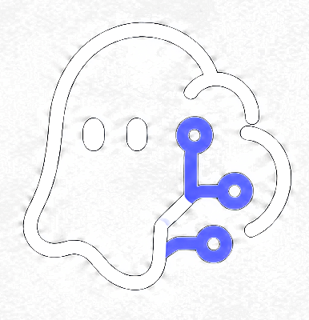

  

<h1 align="center">Noeth</h1>

  The invisible AI desktop assistant. 
  Real-time answers and support — always one shortcut away.

  <a href="https://noeth.dev">noeth.dev</a> &nbsp;·&nbsp;
  <a href="mailto:support@noeth.dev">support@noeth.dev</a>

---

## Download

Head to the [**Releases**](../../releases) tab to download the latest version for your platform.

| Platform | File |
|----------|------|
| Windows (Installer) | `Noeth Setup x.x.x.exe` |
| Windows (Portable)  | `Noeth x.x.x.exe` |
| Linux (AppImage)    | `Noeth-x.x.x.AppImage` |
| Linux (DEB)         | `noeth_x.x.x_amd64.deb` |
| Linux (RPM)         | `noeth-x.x.x.x86_64.rpm` |
| macOS               | Coming soon — package available, signing in progress |

## Installation

### Windows
1. Download `Noeth Setup x.x.x.exe`
2. Run the installer — you can opt in to a desktop shortcut and launch on finish
3. Use the global shortcut to bring up Noeth at any time

### Linux

**AppImage**
1. Download `Noeth-x.x.x.AppImage`
2. Make it executable: `chmod +x Noeth-x.x.x.AppImage`
3. Run it: `./Noeth-x.x.x.AppImage`

**DEB (Debian / Ubuntu)**
1. Download `noeth_x.x.x_amd64.deb`
2. Install: `sudo dpkg -i noeth_x.x.x_amd64.deb`

**RPM (Fedora / RHEL / openSUSE)**
1. Download `noeth-x.x.x.x86_64.rpm`
2. Install: `sudo rpm -i noeth-x.x.x.x86_64.rpm`

### macOS

> **Coming soon.** The macOS package is built and available, but we are still working on code signing. Once signing is complete it will be listed here.

## Support

Reach out at [support@noeth.dev](mailto:support@noeth.dev) for help with licensing or any issues.
